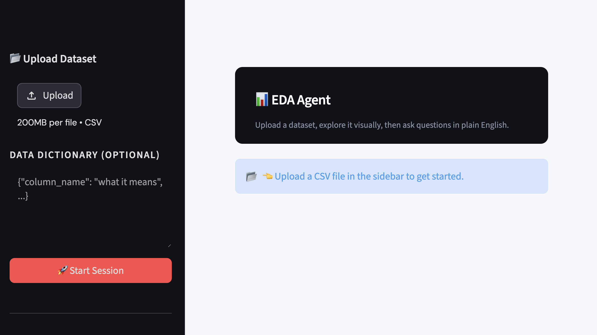

# 📊 EDA Agent

A conversational AI agent that performs **Exploratory Data Analysis** on any CSV dataset. Upload your file, get structured visual insights, and ask follow-up questions in plain English. Everything works through a clean Streamlit interface backed by a FastAPI service and a LangGraph ReAct agent powered by GPT 5.2.

- Supports comma, semicolon, and tab-delimited CSV files (delimiter auto-detected)
- Handles UTF-8, UTF-8 BOM, and Latin-1 encoded files


---

## Preview




## How it works

```
CSV Upload → FastAPI session → LangGraph agent (GPT-5.2 + EDA tools) → Streamlit UI
```

The agent follows a strict EDA protocol:

1. **Schema Understanding** — column types, categories, identifiers
2. **Data Quality Assessment** — missing values, outliers, inconsistencies
3. **Feature Relationships** — correlations, redundancies, predictive signals
4. **ML Opportunities** — suggested problems, target variables, business relevance
5. **Feature Engineering** — encoding, aggregations, interactions

Visualisations (distributions + correlation matrix) are generated server-side and rendered inline in the UI at the relevant sections of the report. The protocol for the agent is never modified by the user and sits in `prompts.py`. The tools are python function binded to the LLM and defined in `tools.py` -- they ensure the LLM applies these operations precisely. 


## Project structure

```
eda_agent/
├── main.py            # FastAPI app — session management + endpoints
├── agent.py           # LangGraph graph + assistant node
├── tools.py           # EDA tools (schema, missing values, correlations, outliers…)
├── prompts.py         # System prompt + data dictionary injection
├── viz.py   # Matplotlib/Seaborn plots → base64 PNG
├── session_store.py   # In-memory session store (this can be swapped in production)
├── ui.py              # Streamlit frontend
└── requirements.txt
```

---

## Quickstart

### 1. Clone the repo

```bash
git clone git@github.com:Geist2307/EDAAgent.git

# navigate to he folder
cd EDAAgent
```

### 2. Create a python environmnet and install dependencies

First ensure that you have python installed and then from the terminal :

```bash
python3.11 -m venv .venv
source .venv/bin/activate  # Windows: .venv\Scripts\activate
pip install -r requirements.txt
```

### 3. Set your OpenAI API key

```bash
export OPENAI_API_KEY="sk-...
```

### 4. Start the API server

```bash
uvicorn main:app --reload
```

You should see:
```
INFO:     Application startup complete.
```

The API docs are available at `http://localhost:8000/docs`.

### 5. Start the UI (new terminal)

Then when opening a second terminal for Streamlit, navigate to the project folder and activate again:

```bash
cd path/to/EDAAgent # the path where you cloned the repo
source .venv/bin/activate
streamlit run ui.py
```

Opens automatically at `http://localhost:8501`.

---

## Usage

### Step 1 — Upload your dataset

Use the **sidebar** to upload a CSV file. Optionally paste a data dictionary as JSON to give the agent column-level context:

```json
{
  "order_id": "Unique identifier for each order",
  "customer_age": "Age of the customer in years",
  "churn": "Whether the customer churned (1) or not (0)"
}
```

Click **Start Session**.

### Step 2 — Explore the visuals

Three tabs appear automatically:
- **Distributions — Numerical**: histograms for every numeric column
- **Distributions — Categorical**: bar plots for every categorical column  
- **Correlation Matrix**: Pearson heatmap across all numeric features

### Step 3 — Chat with the agent

Use the suggested prompts or type your own:

> *"Produce a full EDA report for this dataset."*

> *"Which features would you prioritise for a classification model?"*

> *"Are there any columns I should drop before modelling?"*

The agent retains full conversation history within a session, so follow-up questions work naturally.

---

## Use cases

### E-commerce customer data

Upload a dataset with order history, demographics, and churn labels.

The agent identifies churn as a binary classification target, flags customer age and order frequency as key predictors, highlights missing postcode values, and suggests RFM (Recency, Frequency, Monetary) feature engineering.

**Example prompt:**
> *"What features are most likely to predict churn, and what transformations would you recommend?"*

---

### Financial transactions

Upload a dataset of timestamped transactions with amounts, merchant categories, and fraud labels.

The agent detects the temporal column, proposes anomaly detection and fraud classification as ML problems, flags heavy right-skew in the `amount` column, and suggests log transformation and time-of-day binning as feature engineering steps.

**Example prompt:**
> *"Are there any patterns in the data that could indicate fraudulent behaviour?"*

---

### HR / People analytics

Upload an employee dataset with tenure, department, salary bands, and attrition flags.

The agent groups columns by category, spots salary as a potential proxy for department (redundancy risk), and proposes a regression target for salary prediction alongside a classification target for attrition.

**Example prompt:**
> *"Which departments have the highest attrition risk based on what you can see?"*

---

## API reference

The FastAPI backend can also be used directly (e.g. from a notebook or another service).

| Method | Endpoint | Description |
|--------|----------|-------------|
| `POST` | `/session` | Upload CSV + optional data dictionary → `session_id` |
| `GET` | `/session/{id}/visuals` | Returns base64 PNG images for all plots |
| `POST` | `/session/{id}/message` | Send a message, receive agent reply |
| `DELETE` | `/session/{id}` | End session and free memory |
| `GET` | `/health` | Health check |

---

## Extending to production

This prototype uses in-memory session storage. To productionise:

| Component | Prototype | Production swap |
|-----------|-----------|-----------------|
| Session store | Python dict | Redis |
| Checkpointer | `MemorySaver` | `PostgresSaver` (LangGraph) |
| File input | CSV upload | Database connection string |
| Auth | None | API key / OAuth |
| Deployment | Local uvicorn | Docker + cloud run |

The DB connection extension is a natural extension— replace the CSV upload endpoint with a query interface and pass the resulting dataframe into the same agent pipeline unchanged.

---

## Requirements

- Python 3.11+
- OpenAI API key (GPT-5.5  access)

---

## Notes

- The Agent is designed such that all outputs can be verified manually by inspecting the dataframe
- For high priority decisions, check for yourself the input of the agents
